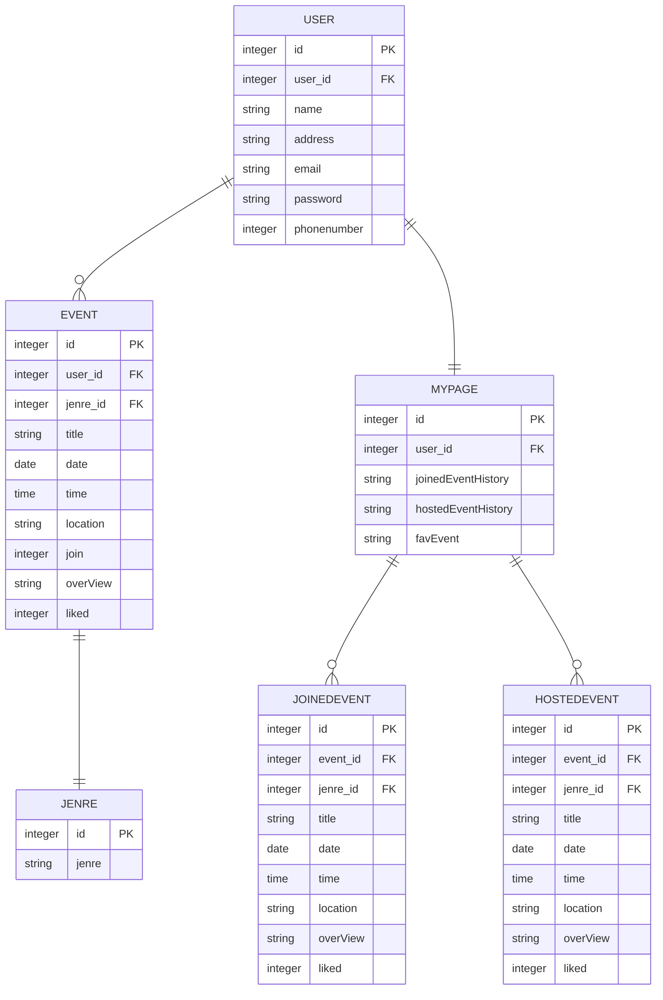

```mermaid
erDiagram
USER ||--o{ EVENT : ""
EVENT ||--|| JENRE : ""
USER ||--|| MYPAGE : ""
MYPAGE ||--o{ JOINEDEVENT : ""
MYPAGE ||--o{ HOSTEDEVENT : ""


USER {
integer id  PK
integer user_id FK
string name
string address
string email
string password
integer phonenumber
}


EVENT {
integer id  PK
integer user_id FK
integer jenre_id FK
string title
date date
time time
string location
integer join
string overView
integer liked
}


JENRE {
integer id PK
string jenre
}

MYPAGE {
integer id  PK
integer user_id FK
string joinedEventHistory
string hostedEventHistory
string favEvent
}

JOINEDEVENT {
integer id PK
integer event_id FK
integer jenre_id FK
string title
date date
time time
string location
string overView
integer liked
}

HOSTEDEVENT {
integer id PK
integer event_id FK
integer jenre_id FK
string title
date date
time time
string location
string overView
integer liked
}

```
